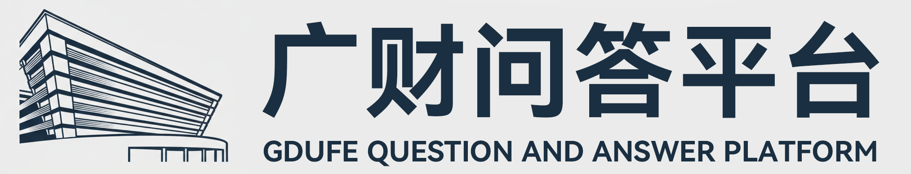
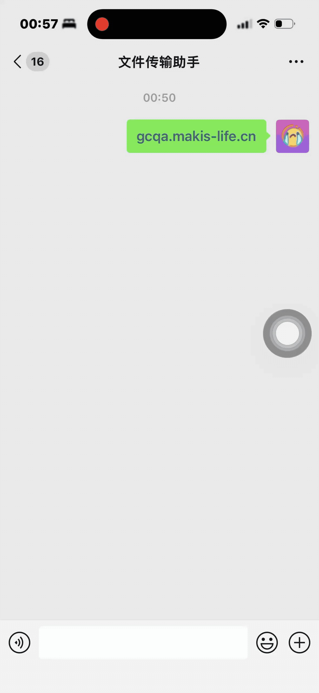
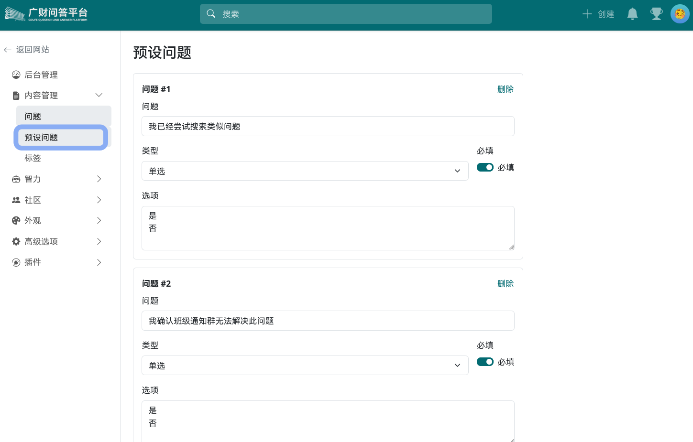
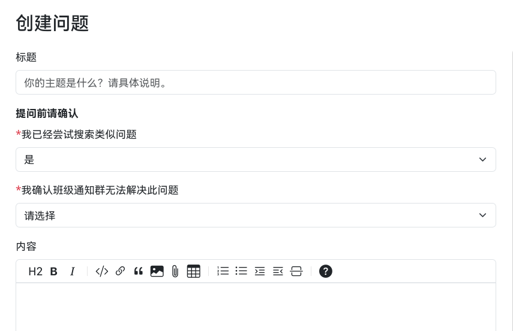
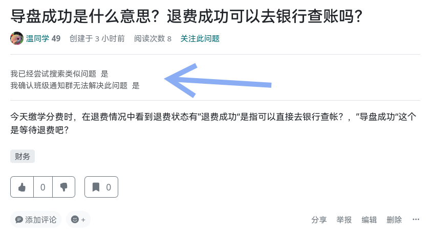
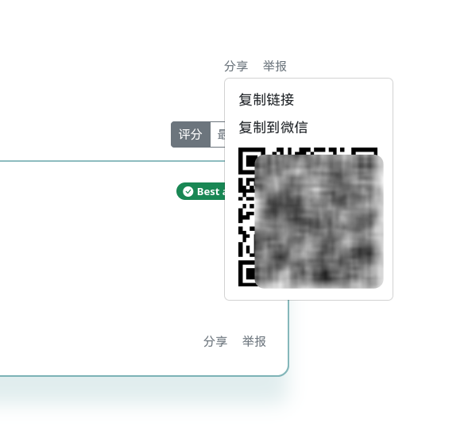
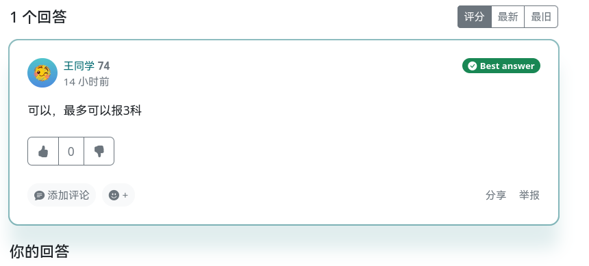
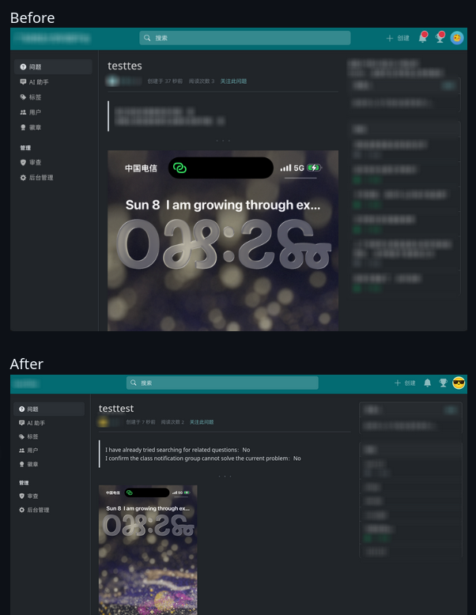
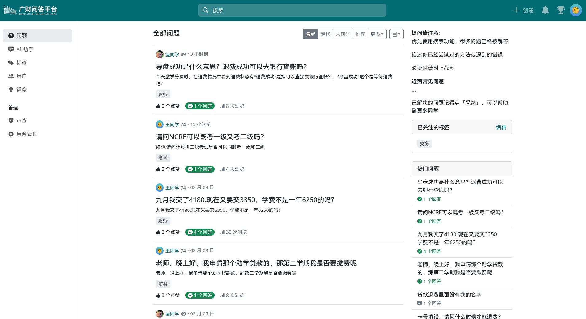

<a href="https://answer.apache.org">
    
</a>

# GCQA - 为广财打造的 Q&A 平台

基于 Apache Answer, 为广财打造的 Q&A 平台。解决当前需要众多咨询群、通知群等方式来获取信息的痛点，提供一个统一的 Q&A 平台，让同学、老师可以方便地获取和分享信息。

有关 Apache Answer, 请查阅 [answer.apache.org](https://answer.apache.org).

[](https://github.com/apache/answer/blob/main/LICENSE)
[](https://golang.org/)
[](https://reactjs.org/)

## 主要改进

以下说明基于 Answer 主要改进的功能

### 企业微信插件

默认集成了企业微信插件，可以直接在微信中扫码注册登录。
需要用户属于管理员所配置的企业微信员工。

<a href="https://answer.apache.org">
    
</a>

### 预设问题

管理员可以在`后台管理`>`内容管理`>`预设问题`中添加预设问题。例如可以要求用户确认已经尝试搜索类似问题或询问相关人员。

**设置页面**


**用户提问界面**


**展示效果**


### 改进分享

删除了 Facebook和X选项，新增`分享到微信`以及`二维码`



### 优化最佳答案外观

添加了最佳答案的突出显示，让最佳答案更易于识别。



### 优化高宽比图片展示



### 其他

df7d9ff9 feat: 把未回答道筛选改为未解决  
726b9f85 feat: 更新秘密信息字段提示，增加可选性说明  
261e9bba feat: 添加非公开问题的提示  
453807c0 feat: 添加问题可见性功能，支持公开和私密问题  
a786bd49 feat: 添加“我的”筛选选项  
1f2e7f48 feat: 添加处理问题的秘密信息功能  
1e0533b3 feat: 添加coversation中的helpful和unhelpful翻译  
40d90544 feat: 添加秘密信息功能，支持加密显示  
5423dd48 feat: 添加图片上传进度条功能，优化上传体验  
3421e21f feat: 更新自编译部署文档，新增发布说明  
0c9adb11 feat: 添加用户手册和安装文档  
eb569df6 feat: 添加忽略规则以排除IntroWebsite_vitepress的node_modules和缓存文件  
5c779768 feat: 介绍网站，vitepress  
797ad2e1 feat: 添加“预设问题”中每一个问题的启用与关闭功能，优化了预设问题的布局  
296c7cd1 feat: 添加启用选项到预设问题配置中，并更新相关国际化文本  
ce01d75d feat: add prompt configuration for AI settings  
65433009 feat: 添加prompt修改入口  
0e6e7844 feat: 更新 README.md，添加企业微信插件说明及相关截图，优化文档内容  
407d60b0 feat: 允许无邮箱企业微信注册，会自动路由到更改邮箱  
8b4fd4e2 feat: 新增企业微信登录  
dfb2bea6 feat: 添加“预设问题”管理页面  
a1ea112a feat: 为采纳的答案添加突出效果  
cf0445e3 feat: 添加DeepSeek模型  
eeacdb5d feat: 分享到微信，以及二维码  
c6814c00 feat: 用户创建问题时确认班级群无法解决当前问题  
60012293 feat: 创建问题时询问用户是否已经尝试搜索相关问题  

## 截图



## 快速开始

### 环境要求

- Golang >= 1.23
- Node.js >= 20
- pnpm >= 9
- [mockgen](https://github.com/uber-go/mock?tab=readme-ov-file#installation) >= 0.6.0
- [wire](https://github.com/google/wire/) >= 0.5.0

### 构建

```bash
# 安装 wire 和 mockgen 用于构建。你可以运行 `make check` 检查是否已安装。
$ make generate
# 安装前端依赖并构建
$ make ui
# 安装后端依赖并构建
$ make build
```

## 开源协议

[Apache License 2.0](https://github.com/apache/answer/blob/main/LICENSE)
